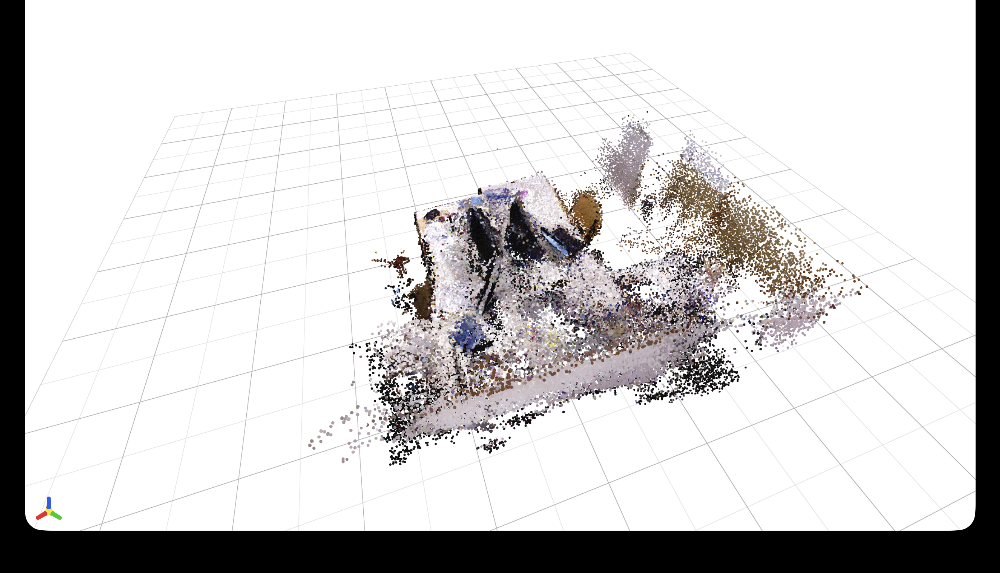
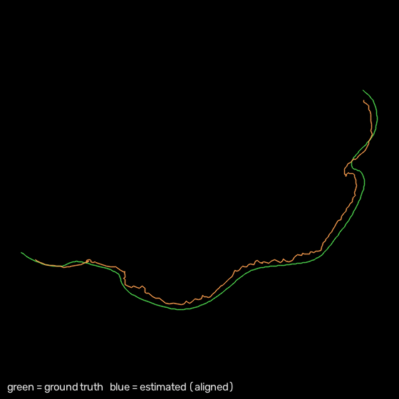
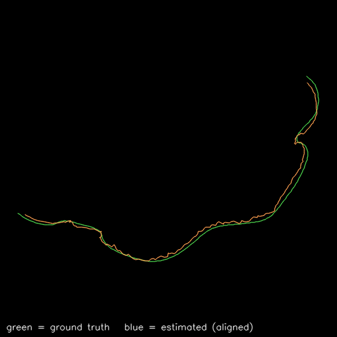

# gsplat-rt

**Real-time monocular video → 3D Gaussian Splats + a physics-ready collision mesh for NVIDIA Isaac Sim.**

gsplat-rt turns a live RGB stream into a 3D scene a robot can both *see* and *touch*: a Gaussian-Splat representation for rendering, an occupancy/collision mesh for physics, and an OpenUSD stage ready to drop into Isaac Sim / Omniverse. It runs the full depth → pose → fusion → export loop in real time on a single GPU, and every performance number below is measured on an NVIDIA A10G — not estimated. A pure-Python mock depth path keeps the whole pipeline (and all non-GPU tests) runnable with no GPU at all.



*Real pipeline output — a monocular RGB stream (TUM fr1/desk) reconstructed into 3D Gaussian splats, with real source intrinsics + cross-frame metric scale.*

<video src="https://github.com/matthewhamilton3141/gsplat-rt/raw/main/docs/reconstruction_turntable.mp4" controls muted loop width="640"></video>

*Orbiting turntable of the same reconstruction (`scripts/render_turntable.py` — a GPU-free numpy point-splat renderer). If the player doesn't load, [download the MP4](docs/reconstruction_turntable.mp4).*

## Headline results *(measured, NVIDIA A10G)*

| Metric | Result |
|---|---|
| End-to-end pipeline | **82.7 FPS** (12.1 ms/frame) — 2.75× the 30 FPS budget |
| TensorRT FP16 depth engine | **6.3 ms/frame** — 2.24× over TF32, output correlation 0.99996 |
| Custom CUDA TSDF fusion | **0.06 ms/frame** — 175× over numpy, bit-for-bit verified |
| Visual odometry (SuperPoint + LightGlue) | **3.5 cm ATE** on TUM fr1/desk — 7.4 ms/frame via TensorRT |
| Monocular metric depth | AbsRel **2.66 → 0.049** (relative → metric, δ<1.25 = 0.97) |
| Test suite | **177 tests**, GPU/dataset rows skip cleanly off-box |

## What it does

A single video stream (webcam or file) enters the pipeline; decoupled stages turn it into a live, physics-ready scene:

1. **Ingest** — frames captured into a bounded queue (1,000+ FPS throughput), decoupled from all downstream work.
2. **Depth** — each frame runs a TensorRT FP16 engine (Depth Anything V2) — genuine strongly-typed FP16 at 6.3 ms/frame.
3. **Track** *(optional)* — a visual-odometry front-end supplies a per-frame camera pose so geometry fuses in a coherent world frame.
4. **Fuse** — depth is integrated into a TSDF volume by a custom CUDA kernel; marching cubes extracts a collision mesh in the background.
5. **Export** — a periodic `.usdz` stage carries a Gaussian-Splat layer for rendering + an invisible collision mesh with `UsdPhysics.CollisionAPI` for PhysX.
6. **Visualize** — glanceable 2-D previews (occupancy floor plan + splat render) and a live browser 3-D viewer, all GPU-free.

## Architecture

```
 RGB stream
     │  bounded queue (drop-oldest)
     ▼
┌─────────────────────────────────────────────┐
│ Coordinator                                 │
│  TensorRT FP16 depth  →  metric-scale (opt) │
│         │                     │             │
│  VO pose (opt) ──────────────►│             │
│         ▼                     ▼             │
│  CUDA TSDF fusion  →  marching-cubes mesh   │
│         └──────► Gaussian splats ───────────┤
└─────────────────────────┬───────────────────┘
                          ▼
         OpenUSD (.usdz) + previews + web viewer
```

Stages run on separate threads and communicate through bounded queues, so depth inference, fusion, and export never block each other. The volume stays resident on the GPU — only depth crosses PCIe per frame. Full thread topology, concurrency design, and the USD schema are in [`docs/architecture.md`](docs/architecture.md).

## Quickstart

```bash
# 1. install  (Python 3.10+, CUDA 11.8+, TensorRT 10+)
git clone https://github.com/matthewhamilton3141/gsplat-rt.git && cd gsplat-rt
pip install -r requirements.txt
pip install tensorrt --extra-index-url https://pypi.ngc.nvidia.com   # not on default PyPI
python setup.py build_ext --inplace                                  # builds the CUDA TSDF kernel

# 2. build the depth engine (ONNX → TensorRT FP16)
python src/depth/export_onnx.py --fp16
python src/depth/compile_trt.py --fp16

# 3. run the live pipeline (webcam) with the dashboard
python scripts/run_live.py --source 0 --ascii-map

# 4. watch it form in 3D (browser, no Omniverse needed)
python scripts/run_viewer.py --source 0        # then open http://localhost:8000
```

No GPU? Everything above runs against the mock depth estimator — the pipeline, previews, and viewer all work on a laptop. Each run writes a `.usdz` scene plus occupancy / splat preview PNGs into `output/`.

**Camera tracking (SLAM front-end).** Score the visual-odometry front-ends or enable one live:

```bash
python scripts/eval_odometry.py --frontend superpoint --provider tensorrt   # 3.5 cm ATE
# in the pipeline: PipelineConfig(pose_tracking="superpoint", pose_backend="tensorrt")
```

**Interactive 3-D.** `scripts/run_viewer.py` (stdlib Three.js — press `A` to toggle points ↔ anisotropic splats) or `scripts/view_scene.py --ply … | --demo` (a [viser](https://github.com/nerfstudio-project/viser) viewer with auto-upright framing).

**Isaac Sim.** Load the exported `output/live_scene.usdz` as a payload; the Gaussian layer renders and the collision mesh drives PhysX.

## Key capabilities

- **TensorRT FP16 depth** — a strongly-typed FP16 engine (uniform-fp16 ONNX, retargeted internal casts) at 6.3 ms/frame, 2.24× over TF32 with 0.99996 output correlation. dtype-aware runner handles either engine. → [`docs/precision.md`](docs/precision.md)
- **Custom CUDA TSDF fusion** — a one-thread-per-voxel integrate kernel, 0.06 ms/frame (175× over numpy), matched bit-for-bit against a CPU oracle. Lives on the GPU; numpy fallback off-box.
- **Monocular metric scale** — DPT-protocol scale+shift with robust IRLS + two-view triangulation anchor + cross-frame propagation, cutting AbsRel 2.66 → 0.049 on TUM and holding scale drift at ~0% over a run. One flag turns a pure monocular stream metric. → [`docs/metric_scale.md`](docs/metric_scale.md)
- **Learned SLAM front-end + back-end** — SuperPoint + LightGlue visual odometry (3.5 cm ATE, 18× faster via TensorRT than onnxruntime) behind a pluggable `Frontend`, plus keyframing and a dependency-free SE(3) pose-graph optimizer that closes loops and distributes drift. → [`docs/slam.md`](docs/slam.md)
- **Gaussian optimizer** — a differentiable 3DGS rasterizer with hand-derived analytic gradients (finite-difference verified), the full `(1−λ)L1 + λ D-SSIM` loss, and Adaptive Density Control; runs as an offline finalize stage exporting optimized `.ply` splats. → [`docs/gaussian_optimizer.md`](docs/gaussian_optimizer.md)
- **Visualization + export** — OpenUSD `.usdz` (splats + collision proxy), 2-D occupancy/splat previews, and browser viewers (stdlib Three.js viewer + an optional viser viewer with auto-upright framing).

**Measured SLAM accuracy** — estimated trajectory (orange) vs TUM fr1/desk ground truth (green):

| ORB + PnP | SuperPoint + LightGlue |
|:---:|:---:|
|  |  |
| 5.7 cm ATE | **3.6 cm ATE** (3.5 cm via TensorRT) |

## Testing & reliability

177 tests (pytest); GPU- and dataset-dependent rows skip cleanly off-box. The pipeline degrades gracefully by design — no CUDA/TensorRT falls back to numpy + a mock depth estimator, so the full system runs and is verifiable on a CPU-only laptop. Numerics are held to references (CUDA TSDF bit-for-bit vs a CPU oracle; analytic gradients vs finite differences). Full performance table + test matrix: [`docs/benchmarks.md`](docs/benchmarks.md).

## Roadmap

- **Loop detection** — descriptor retrieval + geometric verification to feed the pose-graph optimizer real loop constraints (front-end + back-end are done).
- **Isaac Sim live reload** — hot-swap the `.usdz` stage as new geometry arrives, without restarting the sim.
- **Gaussian optimizer** — SH view-dependent colour and an online CUDA fit.

## Related experiments

- **LingBot-Map → TensorRT** — a separate optimization study taking a VGGT-style streaming reconstruction foundation model to TensorRT. Measured **1.76× FP16 per block** (kernel fusion at equal precision), an honest INT8 negative result, and a full **end-to-end integration** swapping all 24 aggregator blocks that quantifies why the per-block win *doesn't* translate whole-model (~1.08×) — the frame blocks aren't the bottleneck. Getting a correct number took dynamic-batch optimization profiles, current-stream execution (fixing a precision-independent NaN race), autocast mixed-precision matching, and shared TRT device memory. See [`scripts/lingbot_trt/RESULTS.md`](scripts/lingbot_trt/RESULTS.md).

## Tech stack

Python · PyTorch · TensorRT · custom CUDA · OpenUSD · OpenCV · NumPy — targeting NVIDIA Isaac Sim / Omniverse.

## License

MIT
