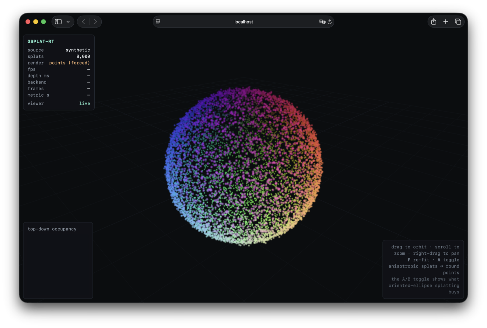
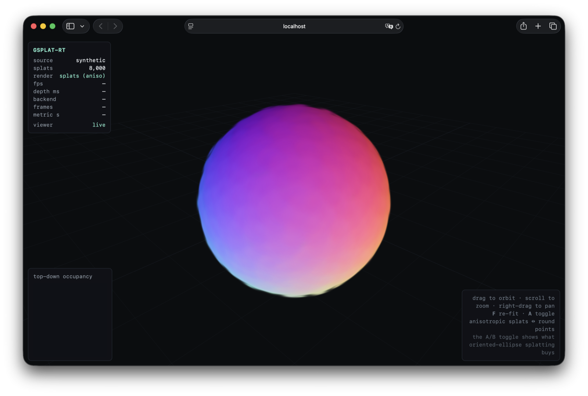

# gsplat-rt

Real-time conversion of live video into 3D Gaussian Splats with a physics-ready collision mesh, exported as an OpenUSD stage for NVIDIA Isaac Sim and Omniverse.

> **Status: work in progress** — a portfolio project exercising the full NVIDIA real-time-3D stack (custom CUDA, TensorRT, PyTorch, OpenUSD). Every performance figure below is **measured on an NVIDIA A10G**, not estimated. A Python-only mock depth estimator keeps the whole pipeline and all non-GPU tests runnable GPU-free.

**Headline results (measured, NVIDIA A10G):**

- **End-to-end pipeline: 82.7 FPS** (12.1 ms/frame) — 2.75× the 30 FPS real-time budget.
- **True-FP16 TensorRT depth engine: 6.3 ms/frame** — 2.24× over TF32, output correlation 0.99996.
- **Custom CUDA TSDF kernel: 0.06 ms/frame** — 175× over the numpy integrator, bit-for-bit verified.
- **M6 SLAM — SuperPoint + LightGlue visual odometry: 3.5 cm ATE** on TUM fr1/desk (vs 5.7 cm ORB baseline), at **7.4 ms/frame** via a TensorRT FP16 engine.
- **M5 Gaussian optimizer:** differentiable 3DGS rasterizer with hand-derived analytic gradients (finite-difference verified), the full `(1−λ)L1 + λ D-SSIM` loss, and Adaptive Density Control.
- **Monocular metric scale:** DPT-protocol scale+shift + cross-frame propagation cuts depth AbsRel **2.66 → 0.049** (δ<1.25 0.97) on real TUM fr1/desk — a pure-monocular stream yields a metric map.

See [Measured performance](#measured-performance-nvidia-a10g) and [Milestones](#milestones).

## What it does

A single video stream (webcam or file) enters the pipeline. Concurrent stages transform it into a live scene description that a reinforcement-learning robot can see and physically interact with:

1. **Video ingestion** — frames captured into a bounded queue at 1,000+ FPS throughput, decoupled from all downstream processing.
2. **Depth estimation** — each frame runs through a TensorRT engine built from Depth Anything V2 Small — a genuine **strongly-typed FP16 engine at 6.3 ms/frame on an A10G** (2.24× over TF32, output correlation 0.99996; see [precision note](#a-note-on-precision-fp16-vs-tf32)).
3. **Camera tracking (optional)** — an RGB-D visual-odometry front-end (ORB baseline, or a learned SuperPoint + LightGlue front-end) supplies a per-frame camera pose, so geometry fuses coherently in a world frame instead of at a fixed camera.
4. **Geometry extraction** — depth maps are fused into a TSDF volume (**custom CUDA kernel, 0.06 ms/frame**, numpy fallback) at 10 Hz; marching cubes extracts a coarse collision mesh in a background thread.
5. **USD export** — a `.usdz` stage is written periodically containing a `ParticleField` Gaussian Splat layer for NuRec rendering and an invisible `UsdGeom.Mesh` collision proxy with `UsdPhysics.CollisionAPI` for PhysX.
6. **2-D previews** — alongside each export, two glanceable PNGs are written so you can eyeball a run without a USD viewer: a top-down **occupancy map** (floor plan from the TSDF) and a depth-colored **splat preview** (the point cloud projected through the camera). These need only numpy + OpenCV, so they render even when `pxr` and CUDA are absent.

## Architecture

```
┌─────────────────────────────────────────────────────────────┐
│  VideoCapture thread                                        │
│  OpenCV → resize 640×480 → bounded queue (drop-oldest)     │
└──────────────────────────┬──────────────────────────────────┘
                           │ queue.Queue
┌──────────────────────────▼──────────────────────────────────┐
│  Coordinator thread                                         │
│  ├─ TensorRT FP16 depth infer  (pre-alloc device buffers)  │
│  ├─ metric-scale align (opt.)   relative → metric depth     │
│  ├─ VO pose provider (opt.)     ORB / SuperPoint+LightGlue  │
│  ├─ Gaussian back-projection   (camera → world via pose)    │
│  ├─ push_depth ──────────────────────────────────────────┐  │
│  └─ periodic USD export  (atomic os.replace → .usdz)     │  │
└──────────────────────────────────────────────────────────┼──┘
                                                           │ queue.Queue
┌──────────────────────────────────────────────────────────▼──┐
│  TSDFWorker thread  (10 Hz)                                 │
│  CUDA TSDF integrate (numpy fallback) → marching cubes      │
└─────────────────────────────────────────────────────────────┘
```

**Lock-free hot path.** Inter-thread handoffs use `queue.Queue`. Gaussian positions accumulate in a `collections.deque` (GIL-atomic appends). USD stage writes happen exclusively on the Coordinator thread — no mutex required.

**Exception isolation.** Every thread target is wrapped in a try/except. Crashes set a shared `_stop_event` and are re-raised in the caller's thread on `stop()`. Optional stages (metric-scale, pose provider) that fail to build are caught and the pipeline coasts (identity pose / relative depth) rather than crashing.

## Requirements

| Requirement | Version |
|---|---|
| Python | 3.10+ |
| CUDA toolkit | 11.8+ |
| TensorRT | 10+ (11 for true FP16 / strongly-typed) |
| PyTorch | 2.1+ |
| OpenCV | 4.8+ |
| OpenUSD (`pxr`) | 23.05+ or bundled with Isaac Sim |

A Python-only mock depth estimator is included so the pipeline and all non-GPU tests run on any machine.

## Installation

```bash
git clone https://github.com/matthewhamilton3141/gsplat-rt.git
cd gsplat-rt
pip install -r requirements.txt

# Custom CUDA kernels (TSDF integrate) — builds gaussian_kernels into src/
python setup.py build_ext --inplace
```

TensorRT is not on PyPI's default index:
```bash
pip install tensorrt --extra-index-url https://pypi.ngc.nvidia.com
```

## Getting started

### Step 1 — export the depth model to ONNX

Downloads Depth Anything V2 Small from HuggingFace and exports a fixed-shape graph (no dynamic axes, for maximum TRT fusion). Add `--fp16` for the uniformly-fp16 graph the true-FP16 engine needs.

```bash
python src/depth/export_onnx.py          # → models/depth_v2_small.onnx      (TF32)
python src/depth/export_onnx.py --fp16   # → models/depth_v2_small_fp16.onnx (FP16)
```

### Step 2 — compile the TensorRT engine

Builds the engine for your GPU. Use `--fp16` for the strongly-typed FP16 engine (the 6.3 ms path, TensorRT 11); omit it for a TF32 engine (see [precision note](#a-note-on-precision-fp16-vs-tf32)). Run once; ~2–5 minutes.

```bash
python src/depth/compile_trt.py          # → models/depth_engine.engine       (TF32)
python src/depth/compile_trt.py --fp16   # → models/depth_engine_fp16.engine  (FP16)
```

### Step 3 — run the pipeline (and watch it)

The quickest way to run a source and *see* the pipeline working — a live status line plus, with `--ascii-map`, the occupancy map redrawn in your terminal (handy over SSH on a headless GPU box, no file copying):

```bash
python scripts/run_live.py --source 0 --ascii-map        # webcam
python scripts/run_live.py --source clip.mp4 --duration 20
```

```
[  4.5s] depth=tensorrt  fps= 31.2  frames=142   depth= 12.8ms  splats=5000  exports=2
█████████████████████████████
··············█████···········     █ occupied
·····················█········     · free
··········(top-down occupancy)     (blank) unknown — X→right, depth↑
```

It stops on `--duration`, when a file source is exhausted, or on Ctrl-C. Each run writes into `output/`:

```
live_scene.usdz               — scene for Isaac Sim / Omniverse
live_scene_occupancy.png      — top-down occupancy map (floor plan)
live_scene_splat_preview.png  — depth-colored splat cloud preview
```

The PNGs are overwritten in place on every export, so they always reflect the latest scene. Set `write_previews=False` on `PipelineConfig` to skip them.

### Step 3b — watch it in 3D (browser viewer)

The viewer renders the scene as **anisotropic Gaussian splats** — oriented ellipses from each Gaussian's covariance (EWA projection + depth-sorted alpha compositing), the same math the CPU rasterizer uses. Press **`A`** to toggle between that and a plain isotropic point cloud, live, on the same scene:

| isotropic points | anisotropic Gaussian splats (**`A`** to toggle) |
|:---:|:---:|
|  |  |

For a live **3-D** view of the splats forming — orbit/zoom in the browser, no Omniverse needed:

```bash
python scripts/run_viewer.py --source 0          # live pipeline (webcam)
python scripts/run_viewer.py --ply output/live_scene.ply   # a static .ply
python scripts/run_viewer.py --demo              # procedural scene, no GPU/pipeline
```

Then open **http://localhost:8000**. Gaussians with real shape (optimized splats or a `.ply`) render as **anisotropic oriented ellipses**; a raw point cloud falls back to soft round discs — press **`A`** to compare. Splats are coloured per-splat (from the optimizer or the live source frame) or by height, with the top-down occupancy map and live stats (FPS, depth latency, splat count, metric scale) in overlays. Procedural demo shapes: `--scene sphere|plane|axes`. The backend is **pure stdlib** (`http.server` + numpy — no new dependencies); the page pulls Three.js from a CDN. It only *reads* the pipeline via `latest_gaussians()` / `latest_occupancy()` / `stats()`, so it's fully decoupled from the hot path and never perturbs throughput. Works GPU-free (mock depth), so you can demo the whole thing on a laptop.

### Step 3c — camera tracking (SLAM front-end)

Score the visual-odometry front-ends on a TUM sequence (ATE + trajectory render), or turn a tracker on in the live pipeline:

```bash
# Evaluate ATE on TUM fr1/desk (needs: bash scripts/fetch_tum.sh)
python scripts/eval_odometry.py --frontend orb                       # 5.7 cm ATE
python scripts/eval_odometry.py --frontend superpoint --provider tensorrt   # 3.5 cm, 7.4 ms/frame

# The learned front-end needs the fused SuperPoint+LightGlue ONNX:
bash scripts/export_sp_lg.sh             # → models/sp_lg_tum.onnx
```

In the live pipeline, select a tracker via `PipelineConfig`:

```python
PipelineConfig(pose_tracking="superpoint", pose_backend="tensorrt")   # or "orb", "none"
```

Pose tracking produces a coherent world map when depth is metric and scale-consistent (an RGB-D sensor / TUM, or the monocular metric-scale stage below).

### Drive it from Python

```python
from src.pipeline_manager import PipelineManager, PipelineConfig

config = PipelineConfig(
    video_source=0,                       # webcam index or path to video file
    engine_path="models/depth_engine_fp16.engine",
    output_dir="output",
    usd_update_interval_s=3.0,           # write a fresh .usdz every 3 seconds
    pose_tracking="none",                # "orb" | "superpoint" for VO camera tracking
)

with PipelineManager(config) as pipeline:
    input("Pipeline running — press Enter to stop\n")
    print(pipeline.stats())               # {frames, exports, gaussians, depth_ms, depth_backend}
```

### Loading in Isaac Sim

```python
import omni.usd
omni.usd.get_context().open_stage("output/live_scene.usdz")
```

The stage contains:
- `/World/GaussianSplats` — `ParticleField` prim, rendered by Omniverse NuRec
- `/World/CollisionMesh` — invisible `UsdGeom.Mesh` with PhysX `convexDecomposition`

## Project structure

```
gsplat-rt/
├── src/
│   ├── ingestion/
│   │   └── video_stream.py       # threaded OpenCV capture
│   ├── depth/
│   │   ├── export_onnx.py        # HuggingFace → ONNX export (+ --fp16 uniform graph)
│   │   ├── compile_trt.py        # ONNX → TensorRT engine (FP16 strongly-typed / TF32)
│   │   ├── depth_estimator.py    # dtype-aware TRT inference, pre-alloc buffers
│   │   └── metric_scale.py       # relative→metric depth aligner (DPT scale+shift)
│   ├── slam/
│   │   ├── tum_dataset.py        # TUM RGB-D loader (rgb+depth+ground-truth poses)
│   │   ├── rgbd_odometry.py      # pluggable-frontend VO + PnP + ATE eval + pose provider
│   │   ├── superpoint_lightglue.py  # SuperPoint+LightGlue ONNX front-end (onnxruntime)
│   │   └── monocular_scale.py    # two-view triangulation + cross-frame scale propagation
│   ├── mapping/
│   │   ├── collision_proxy.py    # TSDF volume + async mesh extractor + occupancy grid
│   │   ├── tsdf_cuda.py          # CUDA TSDF kernel wrapper + numpy oracle/fallback
│   │   ├── usd_bridge.py         # OpenUSD stage writer
│   │   └── visualization.py      # occupancy map + splat preview PNGs (numpy + cv2)
│   ├── gaussian/                 # differentiable 3DGS optimizer
│   │   ├── rasterizer.py         # EWA-splatting forward + analytic-gradient backward
│   │   ├── ssim.py               # SSIM + analytic D-SSIM gradient
│   │   ├── densify.py            # Adaptive Density Control (clone/split/prune)
│   │   └── optimizer.py          # Adam fit loop / finalize stage
│   ├── viz/
│   │   ├── scene_source.py       # pipeline/.ply/synthetic → SceneSnapshot (+ PLY reader)
│   │   ├── web_viewer.py         # stdlib ThreadingHTTPServer + JSON scene feed
│   │   └── static/               # Three.js SPA (index.html + viewer.js)
│   └── pipeline_manager.py       # central orchestrator (depth, scale, pose, TSDF, USD)
├── kernels/
│   └── tsdf_integrate.cu         # custom CUDA TSDF integrate kernel (175× over numpy)
├── scripts/
│   ├── run_live.py               # run + watch live (dashboard + ASCII map)
│   ├── run_viewer.py             # live 3-D browser viewer (splats + occupancy)
│   ├── bench_pipeline.py         # per-stage latency + FPS benchmark
│   ├── bench_depth.py            # TF32 vs FP16 depth latency + fidelity
│   ├── bench_tsdf.py             # numpy vs CUDA TSDF integrate speed-up
│   ├── eval_odometry.py          # visual-odometry ATE + trajectory render
│   ├── eval_metric_scale.py      # metric-scale AbsRel/RMSE (synthetic + --tum)
│   ├── export_sp_lg.sh           # regenerate the SuperPoint+LightGlue ONNX
│   ├── reconstruct_tum.py        # identity-vs-ground-truth-pose fusion proof
│   ├── fetch_tum.sh              # idempotent TUM sequence download
│   └── brev_setup.sh             # one-shot GPU box bootstrap (Brev/A10G)
├── models/                       # .onnx and .engine files (not committed)
├── tests/                        # 150+ tests (pytest); GPU/dataset rows skip cleanly
├── configs/
├── requirements.txt
└── setup.py                      # torch.utils.cpp_extension for CUDA kernels
```

## Tests

```bash
pytest tests/ -v
```

The suite is 150+ tests; the bulk run GPU-free (mock depth) on any machine. Representative rows:

| Test | Requires | Result |
|---|---|---|
| `test_video_stream_fps` | — | **1,113 FPS** ingestion throughput |
| `test_depth_inference_latency` | GPU | **A10G: 6.3 ms FP16** (2.24× over TF32, corr 0.99996) |
| `test_depth_buffer_reuse` | GPU | Zero GPU memory growth |
| `test_cuda_matches_reference` | GPU | CUDA TSDF == numpy oracle, bit-for-bit |
| `test_odometry_tracks_fr1_desk` | dataset | **5.7 cm ATE**, 100% PnP-tracked |
| `test_pairwise_branch_recovers_known_translation` | — | learned-matcher branch recovers a known motion |
| `test_pose_provider_pipeline` | — | config auto-wires ORB/learned VO into the live pipeline |
| `test_metric_scale_*` | — | scale+shift fit, propagation, pipeline hook (51 tests) |
| `test_gaussian_backward` / `test_ssim` / `test_gaussian_densify` | — | analytic gradients FD-verified; D-SSIM; clone/split/prune |
| `test_tsdf_integration_and_mesh` | — | numpy TSDF + mesh extraction |
| `test_full_pipeline_usdz` | — | valid .usdz, both layers present |
| `test_pipeline_smoke` | — | clean start/stop, no thread errors |

Dataset rows need an extracted TUM sequence (`bash scripts/fetch_tum.sh`) and skip cleanly without it; GPU rows skip without CUDA/TensorRT.

## Measured performance (NVIDIA A10G)

`scripts/bench_pipeline.py`, TensorRT 11.1, **FP16 depth engine + CUDA TSDF kernel**, 500 frames:

| Stage | Budget | Measured (mean / p99) | Verdict |
|---|---|---|---|
| Video ingestion | — | throughput-bound (queue absorbs bursts) | — |
| Depth inference | < 15 ms | **8.7 ms** / 18.2 ms *(TF32 14.2 → FP16 6.3 ms isolated, 2.24×)* | ✓ **true FP16** |
| TSDF integration | < 5 ms/frame | 13.1 ms numpy → **0.30 ms CUDA kernel** | ✓ **175× via custom kernel** |
| Mesh extraction | < 10 ms | 7.7 ms / 12.3 ms | ✓ |
| **Full pipeline (live)** | **≥ 30 FPS** | **12.1 ms/frame → 82.7 FPS** | **✓ 2.75× real-time** |

Two custom-optimisation wins compound here. The **custom CUDA TSDF kernel** (`kernels/tsdf_integrate.cu`) integrates a 64³ grid in **0.06 ms/frame — a 175× speed-up** over numpy (`scripts/bench_tsdf.py`, bit-for-bit verified against the numpy path); wired into `TSDFVolume`'s live path (GPU-resident volume, lazy host sync) it measures **0.30 ms/frame in-pipeline**. The **true-FP16 depth engine** (below) halves the depth stage. Together they lift end-to-end throughput from the 34.7 FPS TF32/numpy baseline to **82.7 FPS**. Stages are decoupled across threads, and PhysX collision runs at 120 Hz via `convexDecomposition` baked at load time.

### A note on precision (FP16 vs TF32)

TensorRT 11.1 removed the weakly-typed `BuilderFlag.FP16`, so true FP16 requires a **strongly-typed** network — which honours the ONNX's own dtypes and inserts *no* auto-casts. `export_onnx.py --fp16` therefore emits a genuinely *uniform* fp16 graph: it converts every weight, forces the graph I/O to fp16, and (the subtle part) **retargets the model's internal `Cast(to=fp32)` nodes** — Depth Anything casts its input to the weight dtype, which otherwise reintroduces an fp32 activation into an fp16 conv and breaks the strongly-typed parse. `DepthEstimator` reads each binding's dtype and sizes its buffers to match, so one estimator runs either engine. Measured on the A10G: **TF32 14.2 ms → FP16 6.3 ms (2.24×)** with output fidelity **corr 0.99996, max|Δ| 0.02** vs TF32 — half precision left the depth map essentially unchanged (`scripts/bench_depth.py`).

## Milestones

Five of these are **built and measured on the A10G**; only M7 remains ahead. Each links to the code and the reproducing benchmark.

- **CUDA TSDF kernel** — *built + measured on the A10G*: a custom one-thread-per-voxel integrate kernel (`kernels/tsdf_integrate.cu`) with a torch binding + numpy fallback (`src/mapping/tsdf_cuda.py`) replaces the numpy 64³ integrator (the one over-budget stage). Measured **0.06 ms/frame vs 10.9 ms numpy — a 175× speed-up**, sub-millisecond and well inside the 30 FPS budget. GPU output matches the production numpy path bit-for-bit (`tests/test_tsdf_cuda.py::test_cuda_matches_reference`, held to a CPU oracle); `scripts/bench_tsdf.py` reproduces the number. It is **wired into `TSDFVolume`'s live path**: the volume stays resident on the GPU (only depth crosses PCIe per frame) and syncs to host lazily for mesh/occupancy extraction; the async collision extractor picks it up automatically when the CUDA build is present, and falls back to numpy otherwise. Verified end-to-end through the threaded extractor on the A10G (`test_tsdf_volume_cuda_matches_numpy` + the full suite green with CUDA active).
- **True FP16 depth** — *built + measured on the A10G*: `export_onnx.py --fp16` emits a uniformly-fp16 ONNX (all weights + forced fp16 I/O + retargeted internal `Cast(to=fp32)` nodes) and `compile_trt.py --fp16` builds a `STRONGLY_TYPED` TensorRT 11 engine that runs genuine FP16; `DepthEstimator` is dtype-aware (reads each binding's dtype, casts host↔device) so it runs either engine. Measured **TF32 14.2 ms → FP16 6.3 ms (2.24×)** at **corr 0.99996** fidelity vs TF32 (`scripts/bench_depth.py`), which — with the CUDA TSDF kernel — takes the live pipeline to **82.7 FPS**. Network-flag logic unit-tested (`tests/test_compile_trt_flags.py`); `scripts/inspect_onnx.py` dumps graph dtypes for debugging.
- **Monocular metric scale** — *built + measured on the A10G (TUM fr1/desk)*: Depth Anything emits *relative* (affine-invariant) depth, so the live monocular path can't produce a metric map — every downstream consumer (`_backproject_gaussians`, the TSDF push, `RGBDOdometry`) assumes the depth value is metric `z`. `src/depth/metric_scale.py` closes the gap with the DPT/MiDaS protocol: a per-frame scale+shift fit (`metric_disparity ≈ s·d + t`) with robust Huber-IRLS reweighting and a temporal EMA so scale stays coherent frame-to-frame; it coasts on the last good scale through reference dropouts. Two anchor sources: a **two-view triangulation** reference for the live monocular path (`src/slam/monocular_scale.py` — essential-matrix relative pose → triangulated metric-consistent depths) and the **RGB-D/TUM sensor depth** for validation. Wired as a config-flagged pipeline stage (`metric_scale_enabled`, off by default → existing metric runs unchanged) between depth inference and the consumers. `scripts/eval_metric_scale.py` on synthetic data: naive relative-as-metric **AbsRel 0.94 → aligned AbsRel 0.00** (perfect recovery). **On real TUM `freiburg1_desk`** (measured, A10G): naive relative-as-metric **AbsRel 2.66, δ<1.25 0.05 → scale-aligned AbsRel 0.049, RMSE 0.148 m, δ<1.25 0.97** — a 54× error reduction, competitive with published metric-depth methods. **Cross-frame scale propagation** (`ScalePropagator`) defeats monocular scale drift: `recoverPose` gives a *unit* baseline per pair, so each pair's depths live in their own gauge — landmarks shared with the previous pair pin the new baseline into one running global gauge (robust-median ratio). `--propagation` demo over a varying-speed trajectory: naive per-pair scale drifts **35.7%** while propagated holds at **0.0%**. This leaves one genuinely-unobservable global factor (the reconstruction's absolute size), pinned by the `anchor` (known first baseline → metres, or 1.0 → consistent arbitrary gauge). The stage is wired end-to-end: `metric_scale_enabled=True, metric_scale_monocular=True` auto-builds the triangulation+propagation reference from the camera intrinsics, so a **pure monocular stream produces metric depth with one flag** (no injection). 51 tests (`tests/test_metric_scale*.py`, `test_monocular_scale.py`).
- **M6 — SLAM pose tracking** — *learned front-end done + TensorRT-accelerated*: RGB-D visual odometry (`src/slam/`) feeds per-frame poses into pose-aware fusion. The detect+match step is a pluggable `Frontend`; the ORB+PnP baseline (5.7 cm ATE on TUM fr1/desk) now has a **SuperPoint + LightGlue** learned upgrade that drops in via a pairwise `match_pair` branch — the fused SuperPoint+LightGlue ONNX (from [LightGlue-ONNX](https://github.com/fabio-sim/LightGlue-ONNX)) jointly matches an image pair, and its correspondences back-project through the previous depth into the same RANSAC-PnP. On TUM fr1/desk (200 frames, A10G) it cuts **ATE-RMSE 5.7 → 3.6 cm** (median 4.7 → 2.9, all frames PnP-tracked) — the estimated trajectory (orange) hugs ground truth (green) far more tightly:

  | ORB + PnP — 5.7 cm ATE | SuperPoint + LightGlue — **3.6 cm ATE** |
  |:---:|:---:|
  |  |  |

  Run either with `scripts/eval_odometry.py --frontend {orb,superpoint}` (add `--provider tensorrt` for the compiled engine). A **TensorRT FP16 engine** takes the learned front-end from 132 ms/frame (onnxruntime CUDA) to **7.4 ms/frame** — an 18× speed-up, well inside the real-time budget — while preserving accuracy (**3.5 cm ATE via TRT vs 3.6 cm via onnxruntime**; FP16 leaves match quality intact). It is wired into the live pipeline via `PipelineConfig.pose_tracking="superpoint"`. Next: GPU end-to-end verification of the live tracked pipeline, keyframing / loop closure, and folding the monocular metric-scale stage into the live mono-depth tracking path.
- **M5 — Gaussian optimizer** — *built + wired into the pipeline*: a differentiable EWA-splatting rasterizer with hand-derived analytic gradients (verified against finite differences to <1e-4) and a numpy Adam loop (`src/gaussian/`). Fits posed views to >60 dB PSNR at ~2 ms/iter on CPU; ports to CUDA/torch on the A10G unchanged. The pipeline now runs it as an **offline finalize stage** (`optimize_on_finalize`): the hot path stashes RGB keyframes + poses, and `stop()` seeds Gaussians from the fused point cloud, fits them against the keyframes, and exports optimized splats as a 3DGS `.ply` — kept off the 30 FPS path since pure-numpy is too slow per frame. The loss is the **full 3DGS photometric loss** `(1−λ)·L1 + λ·(1−SSIM)` (`src/gaussian/ssim.py`): an 11×11 Gaussian-window SSIM with a hand-derived **analytic D-SSIM gradient** (self-adjoint zero-padded filter → exact adjoint; matches finite differences to <1e-5), wired via `finalize_ssim_weight` (default 0.2, the paper value). **Adaptive Density Control** (`src/gaussian/densify.py`) is implemented too: the backward pass surfaces the view-space position gradient + visibility, and the controller **clones** small under-reconstructed Gaussians (nudged along −∇means), **splits** large ones into children sampled from their own 3-D covariance (÷1.6), and **prunes** transparent ones — resizing the Adam moments in lock-step (persisting Gaussians keep their momentum, children start fresh). Opt-in via `finalize_densify`; a fit seeded with a single Gaussian grows itself to reconstruct a multi-Gaussian target. Next: SH view-dependent colour and a CUDA/torch fit fast enough to run online.

### Next

- **M7 — Isaac Sim live reload** — hot-swap the `.usdz` stage in Omniverse as new geometry arrives, without restarting the simulation.
- **M6 tail** — GPU end-to-end verification of the live SuperPoint+LightGlue tracked pipeline, keyframing / loop closure, and metric-scale in the live mono-depth tracking path.
- **M5 tail** — SH view-dependent colour and an online CUDA/torch Gaussian fit.

## License

MIT
